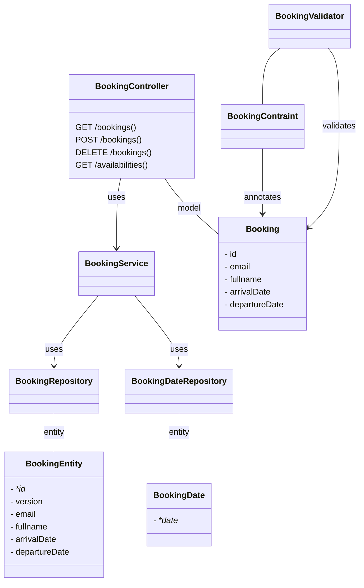
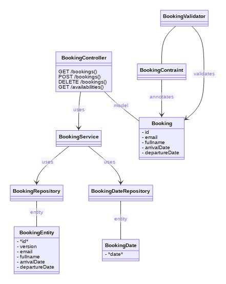

# Diagrams

These diagrams are written with the [mermaid](https://mermaid-js.github.io/mermaid/#/) syntax.

This is not yet supported by GitHub, but the [Mermaid Live Editor](https://mermaid-js.github.io/mermaid-live-editor/) can
be used to render the diagrams.

[
